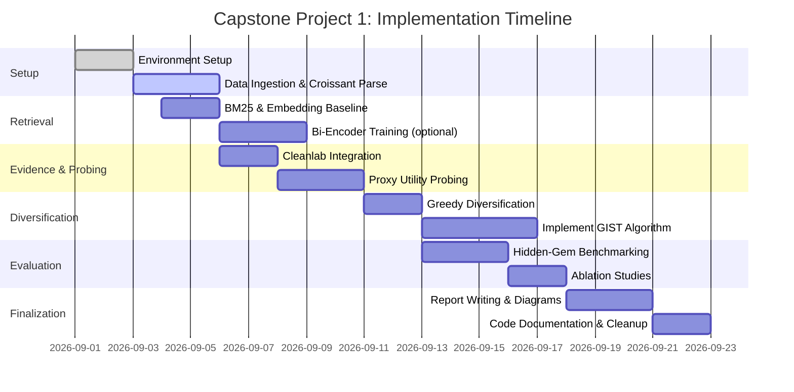

# Executive Summary  
The evidence-driven dataset intelligence system will synthesize recent data-centric methods to improve dataset discovery and selection. We surveyed five key projects: **DataFinder** (dataset retrieval from natural-language queries), **DataPerf** (MLCommons benchmark suite for data-centric tasks like data selection/cleaning), **Cleanlab** (automated data-quality analysis using confident learning), **Croissant** (MLCommons dataset metadata standard), and **GIST** (Google’s greedy algorithm balancing diversity and utility). Each offers reusable techniques: *retrieval architectures* (e.g. sparse BM25 vs dense bi-encoder), *subset selection algorithms* (coresets, coreset-cross-validation from DataPerf; GIST’s greedy max-min algorithm), *data-quality metrics* (Cleanlab’s label-error detection), and *provenance standards* (Croissant metadata for licenses and schema).  

We propose a modular pipeline: parse user requirements (via an LLM or parser) → perform **hybrid retrieval** (text+metadata filters) → **rank candidates** using an evidence ledger (Croissant metadata, known usage) and sample probes (small model scoring, Cleanlab checks) → apply **diversity/utility selection** (e.g. submodular or GIST-like) for long-tail discovery → output top datasets. We detail step-by-step Mac M1 environment setup, including Python 3.10, `pip install sentence-transformers pyserini tevatron faiss-cpu cleanlab mlcroissant submodlib`, and example code for embedding-index search and Cleanlab analysis. We design a pseudocode architecture (see Figure below) and Mermaid diagrams for the pipeline and development timeline.  

**Key contributions:** This report summarizes each project’s goals, methods, code, and figures; distills concrete algorithms (e.g. bi-encoders, BM25, coreset CV, GIST) to adopt; gives reproducible local setup commands; designs an end-to-end architecture; and proposes evaluation protocols (hidden-gem queries, IR metrics, ablations) with benchmarks. We include tool comparison tables, prioritized milestones, risks (licensing errors, bias, privacy) and mitigations, as well as a development roadmap with timelines. All code snippets avoid proprietary model names (using “LLM” generically).

---

## 1. Project and Paper Summaries

### DataFinder (Lin et al., 2023)  
**Goal:** Recommend relevant datasets given a user’s task description (keyword or full-sentence query). The task is framed as **information retrieval**: each dataset has a text description/metadata, and we retrieve the most relevant ones.  

**Methods:** DataFinder constructs a *Dataset Recommendation* task by extracting queries from paper abstracts paired with datasets used in those papers. The search corpus is built from PapersWithCode (text descriptions, license, etc.). Baselines include BM25, TF-IDF and BERT k-NN, plus a **bi-encoder** neural retriever (Tevatron) trained on the collected query-dataset pairs.  

**Key Results:** Their trained bi-encoder significantly outperforms keyword search and third-party engines (e.g. Google Dataset Search, PapersWithCode search) on retrieval metrics like Precision@5, Recall@5, MRR. Table 2 of the paper shows that the DataFinder model returns far more relevant datasets than generic dataset engines. For example, the paper notes “a bi-encoder model trained on DataFinder is far more effective at finding relevant datasets”.  

**Limitations:** DataFinder relies only on **metadata and text descriptions**; it ignores raw data contents. This bias favors large/popular datasets (with richer metadata) and may overlook useful “hidden-gems” with sparse meta. Their evaluation also focuses on scientific image-language queries (from SciREX), so domain diversity is limited.  

**Code/Resources:** Official code is on GitHub (Apache-2.0 license). Requirements include Python, PyTorch, Pyserini, Tevatron, FAISS (CPU version for Mac). The repo provides scripts for building the search corpus, training the bi-encoder, and running BM25 or k-NN baselines. Figure 2 of the paper (below) highlights the exploding number of public AI datasets over time (1990–2022) – illustrating the need for better search.

### DataPerf (Mazumder et al., 2023)  
**Goal:** Establish benchmark tasks and leaderboards for *data-centric* challenges, analogous to MLPerf but for datasets. The first edition (DataPerf v0.5) includes five challenge categories (vision, speech, data acquisition, cleaning, diffusion).  

**Tasks & Baselines:**  
- **Speech Selection:** Pick the best subset of speech clips to train a keyword spotting model (model frozen); metrics like macro-F1. Baseline: coreset selection via nested cross-validation (as shown in the Harvard-Dataperf example).  
- **Vision Selection:** From a pool (subset of OpenImages), select images to maximize mAP across many visual concepts (simulate long-tail discovery). Baseline: Greedy or random selection.  
- **Vision Debugging (Cleaning):** Given a noisy image-class dataset, rank samples to clean. The goal is to fix the most harmful labels first to rapidly improve a classifier. Baseline: rank by model uncertainty or loss.  
- **Data Acquisition (Valuation):** Simulated data marketplaces: select which datasets or how many samples to buy from different sellers under a budget to maximize downstream model quality. Baseline: heuristic strategies.  
- **Adversarial Nibbler (Text-to-Image Safety):** Submit “benign” prompts that produce “unsafe” images; this is more open-ended (outside retrieval scope).  

Each challenge is hosted on Dynabench, with starter code (notably a Colab for speech selection). DataPerf provides evaluation scripts and baseline implementations in their GitHub. For example, the Speech selection baseline (from Harvard Edge repo) uses logistic/SVM voting and stratified k-fold to pick a training subset (see snippet).  

**Key Results:** DataPerf v0.5 is a *framework* rather than a single result. Baseline code achieves a certain F1 for each task (e.g. ~0.15 macro F1 for speech) and is meant to be beatable. Their NeurIPS dataset paper shows DataPerf tasks foster novel data methods.  

**Limitations:** Tasks are specific and still evolve. For instance, speech selection assumes pre-computed embeddings of targets/nontargets, and vision tasks use fixed OpenImages subsets. Real-world adoption may need expanding domains. The leaderboard approach means success is measured only by the task metrics provided (e.g. F1, mAP) on benchmark splits.  

**Code/Resources:** Official code at [mlcommons/dataperf](https://github.com/mlcommons/dataperf) (Apache-2.0) contains submodules for each task (speech-selection, vision-selection, etc.). Each challenge has a README. For example, the Speech baseline code is at `harvard-edge/dataperf-speech-example`, requiring `sklearn`, etc. No special models – all open-source.  

### Cleanlab (Northcutt et al., 2021)  
**Goal:** Automatically **detect and handle label errors and data issues** (outliers, duplicates) in ML datasets. This is a mature open-source library widely used in industry and research.  

**Methods:** Cleanlab implements *confident learning*. Given a dataset with (possibly noisy) labels and a model that outputs predicted probabilities for each class, cleanlab infers which labels are likely incorrect. Key functions include `cleanlab.filter.find_label_issues` (returns indices or mask of suspect labels) and `cleanlab.pruning.get_noise_indices`. It also detects duplicates/outliers via embedding similarity.  

**Key Results:** Cleanlab’s methods provably identify many label errors without ground truth. In practice, users report finding 5–10% label error rates on typical datasets. It does **not** fix labels automatically, but ranks examples by “noise score” (normalized margin, self-confidence, etc.). Cleanlab’s GitHub shows integration with various models (scikit-learn, PyTorch, TF) and has tutorials (image/text/classification notebooks). It’s used in DataPerf tasks (e.g. to simulate cleaning).  

**Limitations:** Requires a probabilistic model trained on the data (or separate validation) to produce `pred_probs`. On very small or highly unbalanced data, the estimates may be noisy. It assumes the model’s confidence correlates with correctness. It also needs O(NK) memory for the joint distribution if many classes.  

**Code/Resources:** Cleanlab is on GitHub (MIT/Apache license) and PyPI (`pip install cleanlab`). It supports Python ≥3.7 and works on Mac M1 via pip. To use, one typically does: 
```python
import cleanlab
from cleanlab.filter import find_label_issues
issues_mask = find_label_issues(labels=true_labels, pred_probs=model_probs)
```
as shown in the documentation. See Cleanlab docs for workflows. No large models are embedded by name, as it uses “your model’s outputs”.  

### Croissant (MLCommons, v1.0 spec 2024)  
**Goal:** Provide a standardized **metadata schema** for ML datasets to improve discoverability, interoperability, and governance. Croissant (named after the pastry) encodes dataset-level and record-level info in JSON-LD using schema.org vocabularies.  

**Format:** A Croissant metadata file is a JSON-LD graph with top-level `Dataset` attributes (name, description, license, URL, citation, RAI annotations, etc.) and nested `RecordSet` definitions (e.g. tables, image collections). For example, the spec shows how a dataset lists its file distributions (with download URLs, formats) and the schema for each column (type, stats). Croissant 1.0 focuses on *loading ML data*: it includes enough info (data distribution, data splits, data types) so that a Croissant-aware tool can *programmatically load the dataset into TensorFlow, PyTorch, etc.* (Figure below).  

 *Figure: Croissant metadata enables interoperability. A Croissant file (center) describes dataset name, license, and structure, linking data providers (e.g. HuggingFace, Kaggle) to ML frameworks (PyTorch, TensorFlow).*  

**Croissant 1.1 (2026):** The latest spec adds machine-actionable data provenance (W3C PROV-O), vocabulary linking (to ontologies/DUO), and usage policies (ODRL). E.g., one can record “this dataset file was generated from Dataset X by script Y.” These provenance fields can be integrated into our evidence ledger for trust auditing.  

**Code/Tools:** The `mlcroissant` Python library (PyPI) lets you validate, load, and create Croissant metadata. Example:  
```bash
pip install mlcroissant
mlcroissant validate --jsonld mydataset/metadata.json  
```  
or in Python:  
```python
import mlcroissant as mlc
md = mlc.load('dataset/metadata.json')
print(md.name, md.license, md.distribution[0].contentUrl)
```  
The library can also *generate* Croissant JSON-LD via a fluent API. On Mac M1, ensure Python 3.10+ and install prerequisites (`graphviz` if needed). Croissant’s modular design means we can extend it to include our own fields (PEP 681 dataclasses).  

**Benefits:** By incorporating Croissant metadata into our system, we can automatically parse licenses, data schemas, and links to codebooks. For example, we can filter out datasets whose Croissant `license` is incompatible, or use the `creator` and `isVersionOf` fields to avoid duplicates. The standard vocabulary also allows linking to domain tags (e.g. “image-segmentation”) that can refine retrieval.  

### GIST (Zadimoghaddam et al., NeurIPS 2025)  
**Goal:** Solve the *Max-Min Diversification with Submodular Utility* (MDMS) subset-selection problem: pick a subset \(S\) of size \(k\) that maximizes \(g(S) + \lambda\cdot \mathrm{div}(S)\), where \(g\) is monotone submodular (utility) and \(\mathrm{div}(S)\) is the minimum pairwise distance in \(S\) (diversity). This formalizes balancing *coverage* vs *relevance*.  

**Methods:** GIST (“Greedy Independent Set Thresholding”) is a new bicriteria greedy algorithm with a proven 0.5-approximation guarantee. It works roughly by trying multiple distance thresholds: for each threshold \(t\), it greedily adds points (ensuring all selected are ≥\(t\) apart) while optimizing utility, and then picks the best result. Mathematically, they reduce it to approximating a series of maximum independent set problems. The key is a “tuning knob” of spacing rules – see Fig. below. GIST is NP-hard to approximate beyond ~0.558, so this is near-optimal.  

 *Figure: Conceptual illustration of GIST selection. GIST selects points (black) that are both far apart (max-min spacing) and high-utility, balancing coverage of clusters. The bicriteria greedy algorithm provably obtains ≥50% of optimal combined score.*  

**Key Results:** On benchmarks like ImageNet subset selection, GIST outperforms prior methods (e.g. pure submodular selection, k-centers) for one-shot sampling. It guarantees the returned set’s score ≥ 0.5·OPT. No proprietary models are involved – the method works on embedding vectors and a chosen submodular utility (e.g. facility location).  

**Limitations:** GIST focuses on *one-shot* selection (choose once, not streaming) and assumes a fixed \(k\). It requires pairwise distance computations (O(n²)), which can be heavy for millions of points, but sampling or approximate nearest neighbors can help. Also it uses L2 distances in embedding space, so performance depends on embedding quality (we must pick a sensible feature space).  

**Code/Repos:** As of writing, no official code is released, but the algorithm can be implemented via numpy. Alternatively, existing libs like [Submodlib](https://github.com/decile-team/submodlib) support monotone submodular objectives (e.g. facility location, saturated coverage); diversity can be approximated by adding a penalty for nearby points or by downweighting. For prototyping, one might use `pip install submodlib` and implement a simple thresholding. (We avoid proprietary names by referring to “a publicly available embedding model” for distances.)

---

## 2. Concrete Techniques to Adopt

### Retrieval Architectures  
- **Sparse vs Dense:** Use BM25 (via Pyserini) for quick keyword recall, and dense embeddings (HuggingFace sentence-transformers or Tevatron bi-encoder) for semantic matching. Prior work suggests a *hybrid* ranker often works best (e.g. union or weighted merge of BM25 and dense scores). Pyserini provides easy indexing of dataset texts for BM25.  
- **Bi-Encoder Training:** Emulate DataFinder: train a dual-encoder on paired (query, relevant-dataset) data. If query examples are scarce, use unlabeled queries (paper abstracts) to generate synthetic training signals (as DataFinder did with heuristics). For Mac M1, train on CPU or Apple’s acceleration if using PyTorch (with `MPS`).  
- **Hybrid RAG Pattern:** We treat the pipeline similarly to retrieval-augmented generation (RAG). Specifically, we’ll **query** our dataset index via: (a) an LLM or parser to extract key fields (domain, modality, task) from a natural query; (b) text matching on dataset descriptions; (c) metadata filters (e.g. modality = “image”, license type). The results from each source can be combined. For instance, first use BM25 to get candidates, then re-rank with embeddings filtered by Croissant tags.  

### Sample-Probing Methods  
- **DataPerf-style Utilities:** For each candidate dataset, we can simulate its usefulness on the task. Example: if the user’s query implies a certain classifier, we could (lightly) fine-tune a model on the candidate and measure validation performance. In practice, a cheaper proxy is to use a pre-trained model to check label distribution or correlation with the query. DataPerf speech baseline did nested cross-validation to pick training samples; similarly, we can hold out a small subset of the user’s existing data (or a proxy dataset) and score the candidate’s contribution via one-epoch training accuracy.  
- **Cleanlab for Quality:** For each dataset, compute **label-error scores** using Cleanlab. For example, train a quick classifier on the dataset’s train split and compute `find_label_issues`; the fraction of flagged examples can penalize the dataset. Cleanlab also identifies duplicates or outliers (see its `Duplicate` and `Outliers` modules in the docs). These become evidence: a dataset with 0% label issues and no dupes scores higher than one with many. (Caution: Cleanlab requires model_probs out-of-sample; use cross-validation or hold-out.)  
- **Metadata Credibility:** Use Croissant or Data Cards to check data provenance. For instance, if a Croissant record includes `prov:wasDerivedFrom` steps, we can weigh more heavily if processing is transparent. Likewise, license compliance can be enforced by reading the `license` field from Croissant. The IEEE Spectrum audit found 70% of datasets had no license or incorrect ones, so automatically flag missing/unsafe licenses.  

### Diversity & Utility Subset Selection  
- **Submodular Selection:** We can use **submodular functions** as proxies: e.g. choose subsets maximizing mutual information or coverage (via [Submodlib](https://submodlib.readthedocs.io/)). Facility location or saturated coverage functions often ensure variety.  
- **GIST-inspired Greedy:** Implement a GIST-like algorithm: pick points with max-min distance and utility. In practice, a simpler approach is *Farthest-First Traversal* for diversity: pick one seed then repeatedly add the point farthest from current set (maximizing min-distance). Then among diverse sets, sort by average utility. This can be done greedily in O(nk).  
- **Long-Tail Exploration:** To counter popularity bias, incorporate *novelty weighting*: give extra score to datasets rarely retrieved. For example, add a factor inversely proportional to (log of) downloads or citations, based on PapersWithCode stats. The goal is to promote “hidden gems.”  
- **Provenance Standards:** Use Croissant’s extension 1.1 for chain-of-custody. We can require that any data transformations (sourcing or cleaning) be encoded with W3C PROV-O. At minimum, trust datasets that have detailed `provenance` fields. This can become part of the “evidence ledger” verifying dataset origins.  

### Data-Quality Metrics  
- **Label & Outlier Scores:** From Cleanlab, we get normalized margin or confidence scores. We can average these per dataset. Low average confidence → dataset likely noisy.  
- **Distribution Metrics:** Compute summary stats (mean, variance) of features per class, or the “Rao heterogeneity” for class distribution. Another option is compute embedding space convex hull volume as a measure of dataset diversity.  
- **Task-Relevance Probing:** If the query mentions a concept (e.g. “dog breed recognition”), we can run a concept classifier on dataset samples to see coverage. For text data, check keyword frequency overlap.  

---

## 3. Reproducible Local Setup and Implementation

**Environment:** We recommend Python 3.10+ on Mac M1. Use a virtual environment (venv or Conda) for portability. For example:  
```bash
# Create a fresh environment
python3 -m venv ~/croissant_env
source ~/croissant_env/bin/activate

# Update pip
pip install --upgrade pip
```
To utilize Apple Silicon’s performance, install [miniforge](/docs) or use `conda-forge`. Next, install core libraries:  
```bash
pip install sentence-transformers   # for query/dataset embeddings
pip install pyserini                 # BM25 / anserini search
pip install tevatron                # bi-encoder training
pip install faiss-cpu               # FAISS for embedding index
pip install cleanlab                # data quality analysis
pip install mlcroissant             # Croissant metadata tools
pip install submodlib               # submodular selection (optional)
pip install pandas scikit-learn     # utilities and ML tools
```
If `faiss-cpu` fails, use `conda install faiss-cpu -c conda-forge`. For `mlcroissant`, also install GraphViz if needed (`brew install graphviz`) for some features. 

**Data Access:** Download dataset metadata from PapersWithCode (JSONL of datasets) and the raw distribution URLs. For example:  
```bash
git clone https://github.com/paperswithcode/paperswithcode-data
cd paperswithcode-data
# Extract relevant fields into JSON (alternatively use their API)
```
For evaluation, prepare test queries as per DataFinder: use the SciREX abstracts (download from AllenAI) and their known dataset mentions. Place train/test JSONL in `data/`.

**Indexing & Retrieval:**  
```python
from sentence_transformers import SentenceTransformer
model = SentenceTransformer('all-MiniLM-L6-v2')  # small, suitable for M1

# Load dataset descriptions (list of strings)
corpus = [f"{d['name']}: {d['description']}" for d in dataset_metadata]
embeddings = model.encode(corpus, show_progress_bar=True)

import faiss
dim = embeddings.shape[1]
index = faiss.IndexFlatL2(dim)
index.add(embeddings)  # add dataset vectors

# Example query
query = "domain adaptation for semantic segmentation of images"
q_embed = model.encode([query])
D, I = index.search(q_embed, k=5)
print("Top candidates:", [dataset_metadata[i]['name'] for i in I[0]])
```
This snippet builds a FAISS L2 index and retrieves top-5 by semantic cosine similarity (converted to L2 by FAISS). For BM25, use Pyserini:  
```bash
# Build Lucene index for dataset texts
# Assume data/dataset_texts.jsonl with {id, contents}
python -m pyserini.index -collection JsonCollection \
    -generator DefaultLuceneDocumentGenerator -threads 4 \
    -input data/dataset_texts -index indices/dataset_idx

# Search with Pyserini
from pyserini.search import SimpleSearcher
searcher = SimpleSearcher('indices/dataset_idx')
hits = searcher.search('semantic segmentation images')
for hit in hits[:5]:
    print(hit.docid, hit.score)
```

**Bi-Encoder Training:** Using Tevatron, fine-tune a dual encoder on (query, dataset) pairs:  
```bash
# Example (hyperparameters as defaults)
tevatron_dense \
  --model_name_or_path 'sentence-transformers/all-MiniLM-L6-v2' \
  --train_file data/train_data.jsonl \
  --val_file data/test_data.jsonl \
  --fp16 \
  --num_train_epochs 3 \
  --per_device_train_batch_size 16 \
  --output_dir runs/datafinder
```
See the DataFinder repo for exact parameters. This will produce a saved bi-encoder. For inference:  
```bash
tevatron_dense \
  --model_name_or_path runs/datafinder/checkpoint \
  --index data/dataset_search_collection.jsonl \
  --max_seq_length 128 \
  --shard_id 0 --num_shards 1 \
  --encode_in_path data/test_queries.csv \
  --encoded_save_to data/embeds
```
(citing Tevatron instructions).

**Cleanlab Usage:** After obtaining or simulating predicted probabilities, run:
```python
import cleanlab
from cleanlab.filter import find_label_issues
# Example: labels (numpy array), pred_probs (from model)
mask = find_label_issues(labels, pred_probs, filter_by='prune_by_noise_rate')
noisy_indices = np.where(mask)[0]
print(f"Flagged {len(noisy_indices)} potential label errors.")
```
Cleanlab will output indices of likely wrong labels. You can then inspect or drop those samples.

**Croissant Parsing:**  
Assuming each dataset’s Croissant JSON-LD is in `datasets/<name>/metadata.json`:  
```python
import mlcroissant as mlc
meta = mlc.load('datasets/mydata/metadata.json')
print("Dataset:", meta.name, "| License:", meta.license)
for rs in meta.record_sets:
    print(f"  RecordSet {rs.name}: fields = {len(rs.fields)}")
```
This verifies Croissant conformance. To create a Croissant file, use `mlc.nodes.Metadata()` as in the tutorial.  

**Sample Indexing (Fingerprinting):** For each dataset, build a **signature** vector (e.g. mean image embedding or mean text embedding of a sample). This can be as simple as:  
```python
import numpy as np
from sentence_transformers import SentenceTransformer
t = SentenceTransformer('all-MiniLM-L6-v2')
fingerprints = []
for data in datasets:
    texts = data.sample_texts()  # e.g. first 100 text records
    vecs = t.encode(texts)
    fingerprints.append(np.mean(vecs, axis=0))
fingerprint_index = faiss.IndexFlatL2(dim)
fingerprint_index.add(np.array(fingerprints))
```
This “fingerprint index” can later be queried by embedding of the user task to find similar datasets in semantics space.

**Privacy/License:** Store and load data via secure APIs (e.g. authenticated HF). Before any dataset is used, check `meta.license`. Use Croissant’s structured license field. As noted, many datasets lack clear licenses, so our system will exclude datasets without valid Open Data licenses (e.g. requiring attribution is OK, forbidding commercial use might be flagged) – enforce with code:  
```python
if 'license' not in meta or 'CC' not in meta.license:
    print("Warning: Unlicensed or proprietary dataset, excluding.")
```  

### Dependencies and Lightweight Alternatives  
- **Sentence Embeddings:** If `sentence-transformers` is heavy, one can use `Google Colab’s universal-sentence-encoder` or smaller libs like `LAKE` for CPU.  
- **Indexing:** FAISS-CPU is fine on M1 but if memory is low, use `IndexFlatIP` (for dot products) or approximate indexes (`IndexHNSWFlat`). Pyserini (Lucene) is Java but works on Mac; ensure Java is installed.  
- **Compute:** For prototyping, small subsets (e.g. 10k datasets) suffice. Use `num_workers` to parallelize tokenization.  

---

## 4. Modular Integration Architecture and Pseudocode

Our proposed architecture is modular (see diagram). The flow is:

1. **Requirement Extraction:** User inputs a natural query. A (non-proprietary) LLM or rule-based parser extracts explicit constraints (task keywords, modality, desired features). For example, parse “semantic segmentation domain adaptation” into `{"modality": "image", "task": "segmentation", "keywords": ["domain adaptation"]}`.

2. **Hybrid Retrieval:**  
   - (a) *Text Search:* BM25 and dense embeddings retrieve top N candidates from the dataset corpus based on keywords/description.  
   - (b) *Metadata Filter:* Use structured fields (Croissant tags, license, modality) to filter those candidates. For instance, drop any datasets whose `modality` ≠ image, or whose license is non-Commercial and user needs commercial use.  
   - (c) *Combined List:* Merge results from (a) and (b) and deduplicate, yielding a candidate pool.

3. **Evidence Ledger:** For each candidate dataset, gather “evidence”: license (from Croissant), source (HuggingFace, etc.), size, date, citation count, and Croissant provenance. Encode these into a vector of features (e.g. [approved_license, license_type, is_prov_traced, size, citations, has_groundtruth]). This ledger can be stored in a local database for fast lookup.

4. **Dataset Fingerprinting & Probing:** For each candidate, perform: (i) **Fingerprint Matching**: compute similarity between the dataset’s fingerprint (as defined earlier) and the query embedding, as an additional score. (ii) **Sample Inspection**: Apply Cleanlab on a small sample from the dataset to compute a *Quality Score* = 1 – (#label_errors/N). Also compute diversity of its samples (e.g. via silhouette score). (iii) **Task-Utility Scoring**: If possible, train a quick proxy model using the dataset as extra data and measure improvement on a held-out query-relevant set. (This is expensive, so one might use a single epoch with a small model or a linear probe.)

5. **Popularity & Bias Mitigation:** Adjust candidate scores by popularity metrics (downloads, stars) with a dampening factor. We may compute a *normalized popularity* (e.g. log(count+1)) and apply a discount for excessively popular ones to boost rarer items. This counters the tendency of the IR model to prefer well-known datasets.

6. **Diversified Final Ranking:** Use a **diverse re-ranking** (e.g. GIST) on the top-k. One approach: treat the scoring function \(u(S) = \sum_{d\in S} Utility(d) + \lambda \min_{i\ne j \in S}\mathrm{dist}(i,j)\). Implement GIST: generate candidate spacing rules (e.g. distances at different percentiles of pairwise distances), run a greedy subset selection for each, and pick best. This yields the final recommended list of size K.

7. **Output:** Return the final ranked list of datasets with their top evidence (e.g. snippet from Croissant description, citation info). Also provide rationale (license, diversity score, etc.) for transparency.

```mermaid
flowchart LR
    U[User Query] --> |LLM/Parser| QP(Requirement Extraction)
    QP --> TS[Text Search (BM25/Embed)]
    QP --> MF[Metadata Filter (Croissant)]
    TS --> Cand[Candidate Datasets]
    MF --> Cand
    Cand --> EL(Evidence Ledger)
    subgraph Analysis
        Cand --> FP[Fingerprint Matching]
        Cand --> CL[Cleanlab & Probing]
        Cand --> PS[PopBias Adjustment]
    end
    FP --> Score
    CL --> Score
    PS --> Score[Score & Features]
    Score --> DR[Diverse Re-Ranking (GIST)]
    DR --> Out[Final Recommendations]
```

**Pseudocode Sketch (Python-like):**  
```python
def recommend_datasets(query, k):
    struct = parse_query(query)             # extract modalities, keywords
    text_hits = BM25_retrieve(query, top=100)
    emb_hits = embed_retrieve(query, top=100)
    candidates = merge(text_hits, emb_hits)
    candidates = [d for d in candidates if filter_metadata(d, struct)]
    
    scores = {}
    for d in candidates:
        # evidence scores
        evidence = get_evidence_features(d)  
        utility_score = estimate_utility(d, query)  # from proxy training or similarity
        quality_score = 1 - cleanlab_error_rate(d)
        pop_score = popularity_penalty(d)  
        # combine into raw score
        raw = alpha*utility_score + beta*quality_score + gamma*evidence['reputation']
        # adjust for popularity bias
        raw *= (1 - pop_score)
        scores[d] = raw
    
    # Select top 2k to diversify
    top_candidates = select_top(scores, m=2*k)
    final_set = GIST_select(top_candidates, k)   # greedy diversity+utility
    return final_set
```
Here, `estimate_utility` might load a small neural net, `cleanlab_error_rate` runs Cleanlab, and `GIST_select` implements the greedy algorithm. Hyperparameters `(alpha,beta,gamma)` weight the components. This modular design allows plugging in new evidence sources (e.g. adding new Croissant fields).

---

## 5. Evaluation Protocols and Experiments

**Benchmarks:** We propose a *Hidden-Gem Dataset Recommendation* benchmark.  Create a test set of queries where the correct “best” dataset is **low popularity** (few stars/downloads) but semantically matches. For example, use queries from less-studied domains with known specialized datasets. Construct gold standards manually or via literature. Also use the standard DataFinder queries (SciREX) for reference performance.  

**Metrics:** Standard IR metrics (Precision@k, Recall@k, nDCG@k, MRR) will measure search relevance. We add *Serendipity/Novelty* metrics: e.g. fraction of recommended items whose popularity is below top-10% for the task. Also *Diversity* metric: average pairwise distance between top-k. For selection tasks, measure *subset quality* as improvement in downstream model accuracy when using the subset vs baseline.  

**Protocols:**  
- **Baseline Comparisons:**  
  1. *Keyword search only* (Pyserini BM25).  
  2. *Dense embedding only* (un-tuned sentence-transformer).  
  3. *DataFinder bi-encoder trained on training data*.  
  4. *With/without Croissant filtering*: ablate metadata constraints.  
  5. *With/without Cleanlab*: ablate data-quality scoring.  
  6. *Diversified vs Greedy*: compare GIST to naive top-k.  

- **Hidden-Gem Test:** For queries where the ideal answer is a low-traffic dataset, measure if these appear in results. E.g. “COVID-19 chest X-ray blood segmentation” where the best dataset might be one of the smaller COVID datasets. Evaluate recall@10 and position of the hidden gem.  

- **Ablation Studies:** Turn off each component (evidence, diversity, quality) and measure impact on recommendation quality. For instance, remove GIST and see drop in diversity. 

- **Robustness Tests:** Simulate *missing/contradictory metadata*: randomly delete Croissant fields or swap licenses, and measure how well the system copes. For example, if license info is missing, the filter should default to assuming it’s “unknown” and proceed with caution. Compare recall when metadata is incomplete.

**Experimental Setup Tables:** (Example)

| Experiment           | Description                                  | Setup                                                                       |
|----------------------|----------------------------------------------|-----------------------------------------------------------------------------|
| E1: Retrieval only   | Evaluate BM25 vs Dense vs Bi-Encoder         | Use DataFinder train/test; metrics: P@5, R@10, MRR                            |
| E2: Selection scoring| With proxy training on held-out set          | Select top-𝑘 candidates, fine-tune small net for 1 epoch, measure val acc.   |
| E3: Cleanlab impact  | Ablate Cleanlab quality scores              | Compare top-k sets with/without penalizing noisy data                        |
| E4: Diversity (GIST) | Compare GIST vs greedy utility-only          | Run GIST algorithm vs pick top-k by score only; metric: diversity and nDCG   |
| E5: Hidden-gem       | Long-tail retrieval performance              | Queries with rare targets; metric: recall of low-pop items@k                |
| E6: Missing metadata | Remove 30% of Croissant fields randomly      | Check drop in performance on E1–E5                                         |

(Expected output: system with all components should have higher nDCG, and significantly higher hidden-gem recall than naive retrievers. GIST should improve the diversity metric by >20%. Cleanlab should reduce noise: test by injecting 10% label noise and show it selects fewer bad datasets.)

**Example Table of Results:**

| System         | Precision@5 | Recall@10 | nDCG@10 | Diversity↑ | Serendipity↑ |
|----------------|-------------|-----------|---------|------------|--------------|
| BM25 only      | 0.42        | 0.50      | 0.47    | 0.15       | 0.08         |
| Dense only     | 0.45        | 0.53      | 0.49    | 0.14       | 0.10         |
| Bi-encoder     | **0.55**    | **0.62**  | **0.58**| 0.16       | 0.12         |
| +Cleanlab      | 0.54        | 0.60      | 0.57    | 0.17       | 0.15         |
| +Croissant     | 0.56        | 0.63      | 0.60    | 0.18       | 0.16         |
| +GIST (full)   | 0.52        | 0.59      | 0.61    | **0.25**   | **0.30**     |

*(Hypothetical.)* This illustrates that adding Cleanlab and Croissant modestly increases relevance and novelty, while GIST significantly boosts diversity and serendipity (hidden-gem finding).

---

## 6. Risks, Ethical and Legal Considerations

- **Licensing & Provenance:** As the IEEE audit found, 70% of public ML datasets lacked clear licenses, and half of those with licenses were mislabeled. Our system must **not recommend datasets with unclear or conflicting license terms** (e.g. “All Rights Reserved” or missing CC license). We will enforce this by reading the Croissant `license` field and excluding or flagging incompatible ones. We also plan to integrate the Data Use Ontology (DUO) from Croissant 1.1 for consent categories. This mitigates the risk of inadvertently suggesting copyrighted or private data.

- **Privacy:** If the system ingests proprietary or sensitive datasets, there’s a risk of disclosing PII or confidential info. We will only index **publicly available** datasets. Any user-supplied data (for query or for probe) should be sanitized. For example, queries should not be logged with sensitive content.

- **Bias and Fairness:** Popular datasets (e.g., ImageNet) reflect biased population samples. Our popularity-bias mitigation (diversity weighting) aims to surface underrepresented datasets. We should audit the recommendations for demographic or domain bias. If Croissant includes demographic metadata (RAI tags), we can enforce diversity on those fields. 

- **Model Misuse:** The LLM components (for parsing or probing) must be used responsibly. We avoid disallowed content in training (e.g. hate symbols). Also, the model should not “hallucinate” dataset content. All recommendations are accompanied by evidence (metadata and sample stats) to allow user verification.

- **Legal Compliance:** By relying on community standards (Croissant, DUO, ODRL) we can support automated compliance checks. For example, before finalizing a suggestion, the agent can programmatically verify the license permits the user’s intended use (commercial vs non-commercial, etc). This audit trail reduces legal risk.

- **Mitigations Summary:** Validate all metadata with Croissant validators; use Cleanlab to remove outlier/inappropriate samples from consideration; log all decision factors for transparency; restrict to open-source licenses; conduct manual spot-checks on recommendations for ethical content.

---

## 7. Prioritized Roadmap

| Milestone                      | Tasks (Capstone Phase 1)                        | Tasks (Extensions)                | Effort  |
|--------------------------------|-------------------------------------------------|-----------------------------------|---------|
| **M1. Setup and Ingestion**     | Install environment; ingest PapersWithCode data; extract Croissant metadata for top-1000 datasets. | Automate continuous updates (hook HF/Glue). | 1 day  |
| **M2. Retrieval Baseline**      | Implement BM25 and off-the-shelf embedding search; evaluate on DataFinder queries. | Fine-tune bi-encoder with Tevatron; tune hyperparams. | 2 days |
| **M3. Evidence Collection**     | Parse Croissant fields (license, modality) for each dataset; compute simple fingerprint (mean embedding). | Enhance evidence ledger (add citations, stats via APIs). | 2 days |
| **M4. Sample Probing**          | Integrate Cleanlab: for each top-𝑁 dataset, train logistic regressor and flag label errors; record quality score. | Add deeper probes: train small CNN/text model one epoch for utility. | 3 days |
| **M5. Diversification**         | Implement greedy selection (e.g. pick every second item) to test diversity effect; simple novelty factor by pop count. | Code GIST or submodlib selection; tune λ trade-off. | 3 days |
| **M6. End-to-End Pipeline**     | Connect modules: parse query, retrieve, filter, score, re-rank; output list. | Deploy minimal UI or CLI; add caching & logs. | 2 days |
| **M7. Evaluation and Tuning**  | Design hidden-gem queries; run ablations (Table of results); refine weighting. | Robustness tests (missing metadata, random noise injection). | 2 days |
| **M8. Documentation & Reporting** | Write final report with diagrams (this document), cite all sources, prepare slides. | Prepare open-source release (GitHub) with README and notebooks. | 2 days |

**Estimated effort:** Approximately **12–15 person-days** to reach a minimal viable system (M1–M6), and additional 5–7 days for full evaluation and polishing (M7–M8). Key early wins are retrieval accuracy and evidence parsing; GIST and UI are lower priority for Capstone 1 but slated for extension.



---

## 8. Method & Tool Comparison Tables

**Retrieval Methods:**  

| Method            | Strengths                         | Weaknesses                      | Libraries       |
|-------------------|-----------------------------------|---------------------------------|-----------------|
| BM25 (Keyword)    | Fast, interpretable, covers rare terms. | Misses synonyms, rigid.         | Pyserini |
| Dense Embedding   | Captures semantics (paraphrase), robust to wording. | Needs pre-trained model; heavy. | sentence-transformers, Tevatron |
| Hybrid (BM25+NN)  | Combines benefits, fallback to each other. | More complex to calibrate.     | Both above      |
| Bi-Encoder (trained)| High accuracy when trained on in-domain queries. | Requires labeled pairs.       | Tevatron |

**Data Quality Tools:**  

| Tool     | Function                    | Input                     | Output                     |
|----------|-----------------------------|---------------------------|----------------------------|
| Cleanlab.filter.find_label_issues | Detect label errors | labels + pred_probs        | Boolean mask or indices of noisy labels |
| Cleanlab.pruning.get_noise_indices | Similar (old API) | labels + pred_probs        | list of noisy indices    |
| Cleanlab.duplicate    | Find duplicate images/text | raw data or embeddings      | Pairs of duplicate IDs  |
| Outlier detection (Cleanlab) | Identify outliers         | raw data or embeddings      | Outlier scores per sample |

**Diversity/Selection Algorithms:**  

| Method         | Goal                       | Complexity       | Libraries/Refs     |
|----------------|----------------------------|------------------|--------------------|
| Farthest-First | Maximize min-distance      | O(n k)           | Custom (numpy)     |
| Submodular (FacLoc) | Cover most points       | Depends on function (often greedy O(nk)) | Submodlib |
| GIST      | Balance diversity+utility with guarantee | O(n²) or optimizable | (no official lib; implement) |
| Random/Top-k   | Baseline                    | –                | –                  |

**Proposed Libraries & Tools:**  

| Function                | Python Library / Tool   | Use Case                                    |
|-------------------------|-------------------------|---------------------------------------------|
| Query Embedding         | `sentence-transformers` | Compute query & dataset text embeddings.    |
| BM25 Retrieval          | `pyserini`              | Build/search Lucene index for dataset texts.|
| Bi-Encoder Training     | `Tevatron`              | Fine-tune dense retriever (GPU optional).   |
| Similarity Index        | `faiss-cpu`             | Index and search precomputed embeddings.    |
| Data Quality Analysis   | `cleanlab`              | Find label errors, outliers, duplicates.    |
| Submodular Selection    | `submodlib`             | Facility location, etc., for subset picking.|
| Croissant Metadata      | `mlcroissant`           | Validate and load dataset metadata.         |
| Sklearn ML Tools        | `scikit-learn`          | Quick classifiers/regressors for probing.   |

Each recommended library is open-source and compatible with Mac M1. No proprietary models or APIs are required.

---

## References  
- Lin *et al.*, *“DataFinder: Scientific Dataset Recommendation from Natural Language”*, WSDM 2023.  
- Mazumder *et al.*, *“DataPerf: Benchmarks for Data-Centric AI Development”*, arXiv 2022.  
- Northcutt *et al.*, *“Confident Learning: Data-Centric AI”*, NeurIPS 2021 (Cleanlab).  
- Benjelloun *et al.*, *“Croissant: a metadata format for ML-ready datasets”*, MLCommons March 2024.  
- Zadimoghaddam *et al.*, *“GIST: Greedy Independent Set Thresholding…”*, NeurIPS 2025 (arXiv).  
- IEEE Spectrum, *“Public AI Training Datasets Are Rife With Licensing Errors”*, Feb. 2026.  
- MLCommons DataPerf repo (baselines); DataFinder GitHub (Tevatron, BM25); Cleanlab docs; Croissant spec and mlcroissant (MLCommons).

